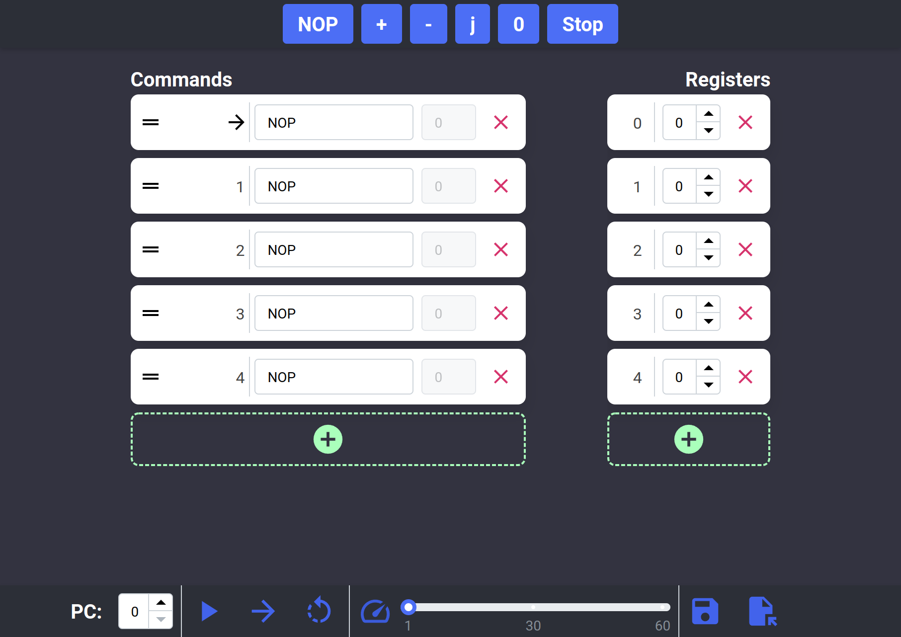

# [Web Know-how Computer](https://truekuehli.github.io/React-Know-How-Computer/)

Web-based simulation of the [Know-how Computer](https://en.wikipedia.org/wiki/WDR_paper_computer), also known as the 
WDR paper computer.

## Features

- Commands and registers can be easily modified, added and removed
- Programs can be executed step by step or as a whole at a user-defined speed
- Programs can be saved and loaded to the browser or shared as a json file

## Usage

### `npm start`

Runs the app in development mode. The app can then be accessed at [http://localhost:3000/](http://localhost:3000/).

### `npm run build`

Builds the app for production to the `build` folder.